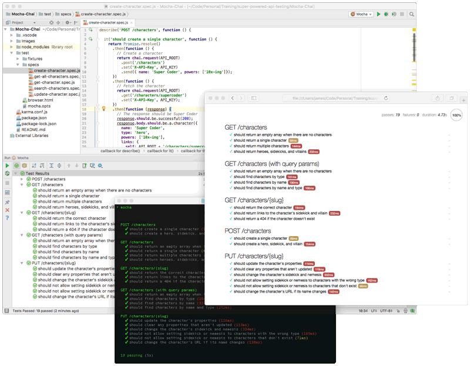
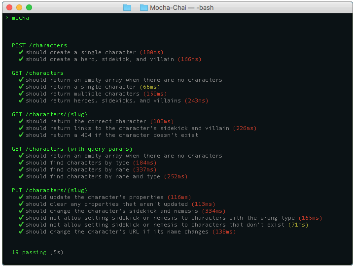
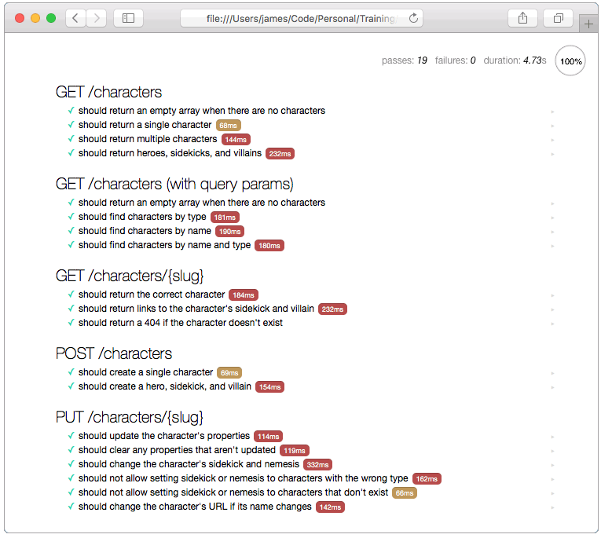
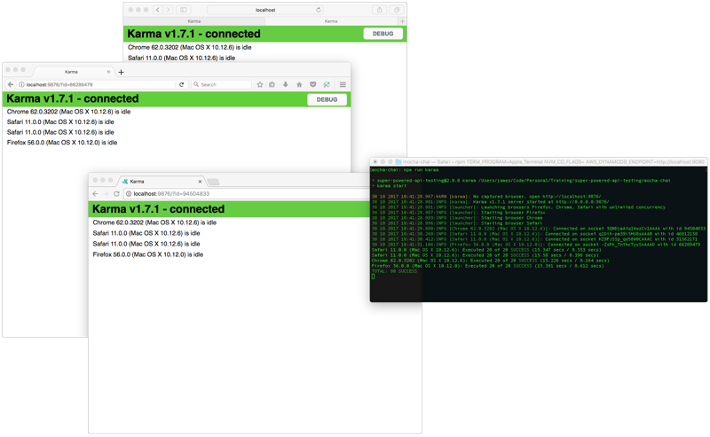

[](http://apitesting.bigstickcarpet.com)

[](http://mochajs.org)
================================================================================

[Mocha](https://mochajs.org/) and [Chai](http://chaijs.com/) are JavaScript libraries that make it easy to write complex API tests using an intuitive fluent syntax that's easy to learn.

- **[Demo setup instructions](#demo-setup)**
- **[Running tests from the command-line](#cli)**
- **[Running tests in an IDE](#ide)**
- **[Running tests in a web browser](#browser)**
- **[Running automated cross-browser tests](#karma)**

<a id="run-everywhere"></a>
Tests that run everywhere
--------------------------------------------------------------------------------
Mocha and Chai give you an impressive list of options for running your tests. There's a CLI for running tests on the command line, which also works well for automated testing as well as CI/CD tools. There are also [plugins](https://mochajs.org/#editor-plugins) for many popular IDEs and code editors, including [VSCode](https://marketplace.visualstudio.com/search?term=mocha&target=VSCode&category=All%20categories&sortBy=Relevance), [Atom](https://atom.io/packages/search?q=mocha), [WebStorm](https://www.youtube.com/watch?v=4mKiGkokyx8), [Visual Studio](https://github.com/Microsoft/nodejstools/wiki/Test-Explorer), and even [Emacs](https://github.com/scottaj/mocha.el).  You can even run your tests in any web browser or mobile device. (more on that below...)



<a id="browser-testing"></a>
Browsers & Mobile testing
--------------------------------------------------------------------------------
This is an important feature that _only_ Mocha and Chai offers. Browsers and mobile devices have many limitations and restrictions in place for security, privacy, and latency reasons, which your API may need to account for.

Are you sure that your API works with [Same-Origin Policy](https://developer.mozilla.org/en-US/docs/Web/Security/Same-origin_policy) and [Content Security Policy](https://developer.mozilla.org/en-US/docs/Web/HTTP/CSP)? Have you properly implemented [CORS](https://developer.mozilla.org/en-US/docs/Web/HTTP/CORS)?  Does your API require any of [the forbidden headers](https://developer.mozilla.org/en-US/docs/Glossary/Forbidden_header_name)? You need to run your API tests on real-world client devices to be sure.

You can use tools such as [Karma](https://karma-runner.github.io/) or [Nightwatch](http://nightwatchjs.org/) to automate cross-browser testing and integrate it into your CI/CD pipeline.  You can also use cloud-hosted device testing services such as [SauceLabs](https://saucelabs.com/) or [BrowserStack](https://www.browserstack.com/) to test on a wider variety of devices.

[](https://wiki.saucelabs.com/display/DOCS/Using+Status+Badges+and+the+Browser+Matrix+Widget+to+Monitor+Test+Results)


Some coding required
--------------------------------------------------------------------------------
Whereas many other API testing tools let you build your tests using a graphical interface, Mocha and Chai are 100% JavaScript code.  This makes it a great choice for people with coding skills, but perhaps not such a great option for teams with a diverse range of people who need to be able to create API tests.

There are numerous benefits to being 100% JavaScript though. As mentioned above, your tests can [run anywhere](#run-everywhere), not just in a vendor-specific tool. You also aren't limited or restricted by the functionality of a tool.  Many API testing tools don't support complex testing scenarios, such as conditional flows, loops, processing data files, setup/teardown steps, etc.  But you can do all that and more in Mocha and Chai because it's just JavaScript.

You can also leverage numerous [Chai plugins](http://chaijs.com/plugins/) as well as the [vast ecosystem](https://www.npmjs.com/) of JavaScript libraries to help you with complex things like [hasing and encryption](https://code.google.com/archive/p/crypto-js/) or [JSON Schema validation](http://chaijs.com/plugins/chai-json-schema/).


<a id="demo-setup"></a>
Demo Setup
--------------------------------------------------------------------------------
In this demo, you'll run [the API tests](./test/specs) from the command-line, in an IDE, in a web browser, and via automated cross-browser testing.

### Step 1. Install Node.js
The Mocha CLI requires [Node.js 4.0 or greater](https://nodejs.org/en/).

### Step 2. Download the demo code
Download [this tarball file](https://registry.npmjs.org/super-powered-api-testing/-/super-powered-api-testing-2.0.0.tgz), which contains the sample tests and scripts to run them.

If you don't have a way to unpack the tarball, then you can use the following [npx](https://www.npmjs.com/package/npx) command:

```
npx decompress-cli super-powered-api-testing-2.0.0.tgz -o .
```

### Step 3. Install dependencies
Open the demo code directory in a terminal and run the following command to install all dependencies.  This will install Mocha and Chai, as well as the [Karma test runner](https://karma-runner.github.io/) to run automated cross-browser tests.

```
cd /path/to/demo/code
npm install
```


<a id="cli"></a>
Running the tests from the command-line
--------------------------------------------------------------------------------
Open the demo code directory in a terminal and run the following command:

```
cd /path/to/demo/code
npm run mocha
```

This command runs the Mocha CLI, which will read the [`mocha.opts`](./test/mocha.opts) file. This file configures several Mocha options, such as timeouts and failure behavior.  It also tells Mocha which test scripts to run.

#### The `test/fixtures` folder
This folder contains scripts that perform initialization logic and define helpers that are used by the tests

|Script file                   |Purpose
|:-----------------------------|:-----------------------------------------------------------
|`test/fixtures/assertions.js` |Defines custom Chai.js assertions, which eliminate redundancy and make our tests more readable (e.g. `response.body.should.be.a.character()`)
|`fixtures/before-each.js`     |Defines a Mocha `beforeEach` hook, which will reset the state before each test by deleting any data that were created by the previous test.
|`test/fixtures/environment.js`|Sets environment variables, such as `API_ROOT` and `API_KEY`. These variables allow us to test against different instances of our API (e.g. dev, staging, prod)
|`test/fixtures/open-api.js`    |This script downloads the [OpenAPI definition](https://api.heroes.bigstickcarpet.com/schema), so we can use it to test whether our API responses match the JSON Schemas.
|`test/fixtures/setup-chai.js`  |This script initializes Chai and loads the [Chai-HTTP](http://chaijs.com/plugins/chai-http/) and [Chai-JSON-Schema](http://chaijs.com/plugins/chai-json-schema/) plugins.




<a id="ide"></a>
Running the tests in an IDE
--------------------------------------------------------------------------------
Many popular IDEs and text editors have built-in support for [Mocha](https://mochajs.org/), so you can easily run your tests with the press of a button and see the results right in your IDE.

  - [How to use Mocha in WebStorm](https://www.youtube.com/watch?v=4mKiGkokyx8))
  - [How to use Mocha in Visual Studio](https://github.com/Microsoft/nodejstools/wiki/Test-Explorer)
  - [Mocha plug-ins for VSCode](https://marketplace.visualstudio.com/search?term=mocha&target=VSCode&category=All%20categories&sortBy=Relevance)
  - [Mocha plug-ins for Atom](https://atom.io/packages/search?q=mocha)
  - [Mocha package for Emacs](https://github.com/scottaj/mocha.el)


<a id="browser"></a>
Running the tests in a web browser
--------------------------------------------------------------------------------
Mocha and Chai can run in web browsers too, which is [very important](#browser-testing) for testing your API in real-world conditions.  You can even run your tests in mobile browsers, such as iOS and Android, and in [hybrid mobile apps](https://developer.telerik.com/featured/what-is-a-hybrid-mobile-app/) such as PhoneGap, Cordova, and React Native.

Just open the [`browser.html`](./browser.html) file in a web browser.  Or run the following command to open it in your default browser:

```
cd /path/to/demo/code
npm start
```

The Mocha web UI automatically runs all of your tests and checks-off each one as they pass.  If any tests fail, you'll see the reason for the failure.  You can click on any test to see the source code for that test.  You can also click the arrows on the far right side of the page to run a single test, which is great for debugging.




<a id="karma"></a>
Running automated cross-browser tests
--------------------------------------------------------------------------------
Mocha and Chai work great with cross-browser automation tools such as [Karma](https://karma-runner.github.io/) or [Nightwatch](http://nightwatchjs.org/), which can easily be integrated into your CI/CD pipeline.  You can also use cloud-hosted device testing services such as [SauceLabs](https://saucelabs.com/) or [BrowserStack](https://www.browserstack.com/) to test on a wider variety of devices.

For this demo, we'll use [Karma](https://karma-runner.github.io/), which is a Node.js-based CLI.  Karma is a powerful with [lots of configuration options](https://karma-runner.github.io/1.0/config/configuration-file.html) and [hundreds of plugins](https://www.npmjs.com/browse/keyword/karma-plugin), which can be daunting at first.  For this demo, I've already created a [`karma.conf.js` config file](./karma.conf.js), so all you need to do is run the following command:

```
cd /path/to/demo/code
npm run karma
```

Depending on your operating system, Karma will automatically launch Chrome, Firefox, Safari, and/or Internet Explorer and run the tests in each browser.  Once the tests are complete, Karma will close the browsers and show the results in the terminal window.

Karma can also run in a "watch" mode, where it will keep the browsers running instead of closing them after the tests finish. In this mode, it will monitor your source code for changes and will automatically re-run the tests each time you save.

Karma can be integrated into [TravisCI](https://karma-runner.github.io/1.0/plus/travis.html), [Jenkins](https://karma-runner.github.io/1.0/plus/jenkins.html), [TeamCity](https://karma-runner.github.io/1.0/plus/teamcity.html), or any other CI/CD tool that can run Node.js scripts.


