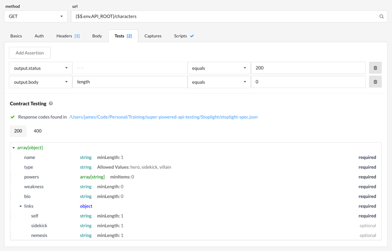
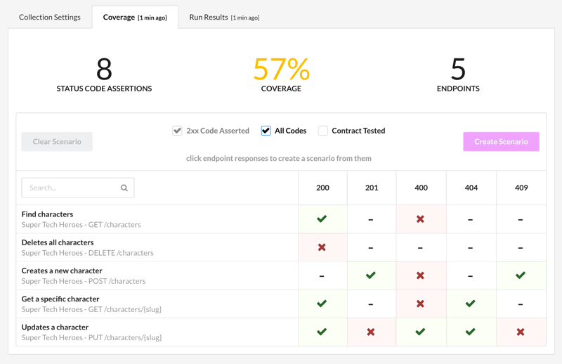

[](http://apitesting.bigstickcarpet.com)

[](http://stoplight.io/)
================================================================================

[Stoplight](http://stoplight.io) is a powerful API development tool that's based on OpenAPI (fka Swagger).  It has tight integration with OpenAPI, including automatic contract verification.

- **[Demo setup instructions](#demo-setup)**
- **[Running tests in Stoplight](#test-runner)**
- **[Running tests from the command line](#cli)**


OpenAPI contract verification
--------------------------------------------------------------------------------
Stoplight is built on top of OpenAPI, so it can leverage the JSON Schemas in your API spec to do automatic contract verification.  You don't need to write any tests to verify that your API responses correctly match your JSON Schema contracts.  Stoplight will just do it for you.




Code coverage
--------------------------------------------------------------------------------
Because Stoplight knows your API definition, it knows which endpoints you have or haven't tested, and which response codes you've checked for.  Using this information, it can show you API code coverage results.  This is a tremendously helpful feature that no other API testing tool has.




<a id="demo-setup"></a>

Demo Setup
--------------------------------------------------------------------------------
In this demo, you'll run a full suite of API tests in Stoplight and from the command line.

### Step 1. Install Stoplight Scenarios
Go to the [Stoplight website](http://stoplight.io/platform/scenarios/) and download the Stoplight Scenarios app.  You'll need to create a free account first.

> **NOTE:** Be sure to download the **Scenarios** app, not the main Stoplight app.  This demo only runs on the Scenarios app

### Step 2. Open Stoplight Scenarios
The first time you open the Stoplight Scenarios, you'll need to sign in and create an organization.

### Step 3. Import the demo files
Go to the "Testing" tab and click the "New Collection" button.  Import the following collection file:

#### Stoplight Collection
This file contains the API requests and the test assertions.

[`http://apitesting.bigstickcarpet.com/stoplight/stoplight-collection.json`](http://apitesting.bigstickcarpet.com/stoplight/stoplight-collection.json)

#### Stoplight Environment
This file contains environment variables, which allow the same Stoplight tests to be run in different environments (e.g. development, staging, prod)

[`http://apitesting.bigstickcarpet.com/stoplight/stoplight-environment.json`](http://apitesting.bigstickcarpet.com/stoplight/stoplight-environment.jso)


<a id="test-runner"></a>

Running tests in Stoplight
--------------------------------------------------------------------------------
After importing the Stoplight collection, you'll see a bunch of folders on the left.  Clicking on any folder will show a screen with "Run Scenario" and "Run Collection" buttons at the top.  Clicking "Run Scenario" will just run the current folder.  Clicking "Run Collection" will run **all** of the tests.

Click the "Home" link on the left menu to go to the root of the Stoplight collection.  Then click the "Run Collection" button to orun all of the tests.  You'll see the test results **very quickly**, since Stoplight runs all tests concurrently.  You can also see the code coverage results on this screen.


<a id="cli"></a>

Running tests from the command line
--------------------------------------------------------------------------------
[Prism](https://stoplight.io/platform/prism/) is Stoplight's command-line test runner.  It actually does a lot more than just run tests, but that's what we'll focus on here.

You can run the Stoplight tests via Prism with the following command:

```
cd /path/to/demo/files
prism conduct stoplight-collection.json --spec stoplight-spec.json --env stoplight-environment.json
```

You can also use Prism to automate Stoplight tests or integrate it into your CI/CD pipeline.  [More info here](https://help.stoplight.io/scenarios/conducting-scenarios-outside-of-stoplight/running-scenarios)


